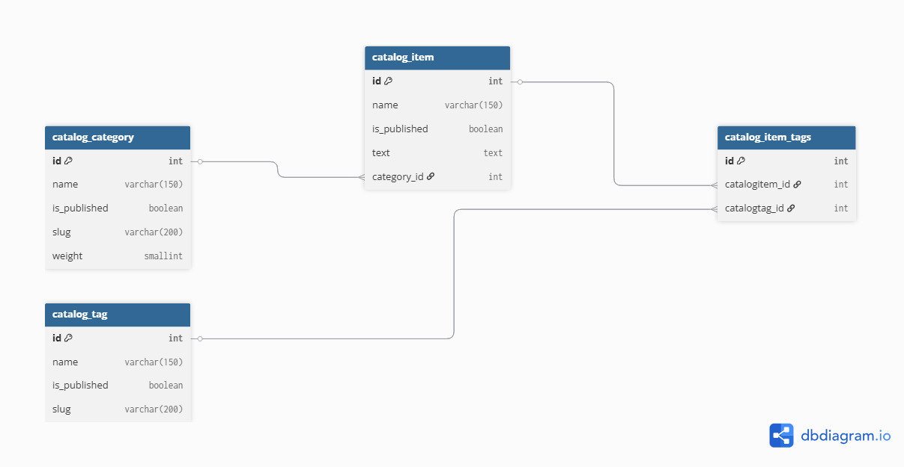

# Учебный проект «Lyceum»

[](https://gitlab.crja72.ru/django/2026/spring/course/students/379829-rizaeffk-course-1585/-/commits/main)

Это учебный проект для Специализации Яндекс Лицея «Веб-разработка на Django.

## CI/CD

В пайплайне настроены проверки:

- `flake8 --verbose` с плагинами:
  - `pep8-naming` (проверка имён по PEP8);
  - `flake8-import-order` (порядок импортов);
  - `flake8-quotes` (проверка кавычек).
- `black --check` (проверка форматирования без изменения файлов).

## Требования

- [Python](https://www.python.org/downloads/) (3.10-3.14)
- [Venv](https://pandac.in/blogs/venv-python/#:~:text=Install%20Python%203%20and%20venv,package%20you%20want%20to%20install.) (для создания виртуального окружения на Linux)
- [Git](https://git-scm.com/install/) (для клонирования репозитория)

## Зависимости

Зависимости разделены по назначению:

- `requirements/prod.txt` — зависимости для запуска проекта;
- `requirements/test.txt` — зависимости для запуска тестов (включает `prod.txt`);
- `requirements/dev.txt` — зависимости для разработки (включает `test.txt`).

## Установка и запуск в dev-режиме (Linux/macOS)

1. Клонировать репозиторий:

   ```bash
   git clone https://gitlab.crja72.ru/django/2026/spring/course/students/379829-rizaeffk-course-1585
   cd 379829-rizaeffk-course-1585
   ```

2. Создать и активировать виртуальное окружение:

   ```bash
   python3 -m venv venv
   source venv/bin/activate
   ```

3. Установить dev зависимости:

   ```bash
   pip install -r requirements/dev.txt
   ```

4. Перейти в директорию проекта с `manage.py`:

   ```bash
   cd lyceum
   ```

5. Создание .env (проект содержит .env.example с дефолтными значениями переменных окружения, при необходимости отредактировать):

   ```bash
   cp .env.example lyceum/.env
   ```

6. Выполните миграцию:

   ```bash
   python3 manage.py migrate
   ```

7. Запустить сервер разработки:

   ```bash
   python3 manage.py runserver
   ```

## Установка и запуск в dev-режиме (Windows)

1. Клонировать репозиторий:

   ```powershell
   git clone https://gitlab.crja72.ru/django/2026/spring/course/students/379829-rizaeffk-course-1585
   cd 379829-rizaeffk-course-1585
   ```

2. Создать и активировать виртуальное окружение:

   ```powershell
   python -m venv venv
   .\venv\Scripts\Activate.ps1  
   ```

3. Установить dev зависимости:

   ```powershell
   pip install -r requirements/dev.txt
   ```

4. Перейти в директорию проекта с `manage.py`:

   ```powershell
   cd lyceum
   ```

5. Создание .env (проект содержит .env.example с дефолтными значениями переменных окружения, при необходимости отредактировать):

   ```powershell
   copy .env.example lyceum\.env
   ```

6. Выполните миграцию:

   ```powershell
   python manage.py migrate
   ```

7. Запустить сервер разработки:

   ```powershell
   python manage.py runserver
   ```

После запуска приложение будет доступно по адресу:

<http://127.0.0.1:8000/>

## Переменные окружения (.env)

В проекте есть .env.example с комментариями. Основные переменные (пример):

```env
# Режим отладки: True для разработки, False для продакшена
DJANGO_DEBUG=True 

# Секретный ключ для криптографических подписей (в продакшене должен быть уникальным!)
DJANGO_SECRET_KEY=secret

# Список разрешенных хостов/доменов, через которые можно обращаться к приложению
DJANGO_ALLOWED_HOSTS="127.0.0.1,localhost"

# Включение middleware для реверса русского текста
DJANGO_ALLOW_REVERSE=False
```

## Дополнительно

- Для запуска тестов перейдите в корневую директорию и установите также:

  ```bash
  pip install -r requirements/test.txt
  cd lyceum
  python manage.py test
  ```

- Для запуска в prod-режиме так же перейдите в корневую директорию:

  ```bash
  pip install -r requirements/prod.txt
  cd lyceum
  python manage.py runserver
  ```

## ER-диаграмма базы данных

Ниже приведена ER-диаграмма, показывающая таблицы и связи в базе данных проекта.



**Кратко:**

- `catalog_category` — категории (1→N товаров);
- `catalog_item` — товары (имеют FK на категорию и M2M на теги);
- `catalog_tag` — теги (используются многократно для товаров).

## Локализация и мультиязычность

В проекте включена локализация интерфейса,
добавлен переключатель языка в шапке и подключен `LocaleMiddleware`.

### Что важно для развёртывания

1. Убедитесь, что установлен `USE_I18N = True` (включено по умолчанию).
2. После изменения переводов обновите сообщения и скомпилируйте их:

   ```bash
   # вариант 1: из корня репозитория
   python lyceum/manage.py makemessages -l ru
   python lyceum/manage.py compilemessages

   # вариант 2: из директории lyceum
   cd lyceum
   python manage.py makemessages -l ru
   python manage.py compilemessages
   ```

3. Примените миграции и перезапустите приложение как обычно.

### Год в футере

- Без JavaScript показывается серверный год (через шаблон ``).
- С JavaScript год берётся из браузера пользователя только если расхождение с серверным временем не более 24 часов.
- Если расхождение больше 24 часов, показывается серверный год.
