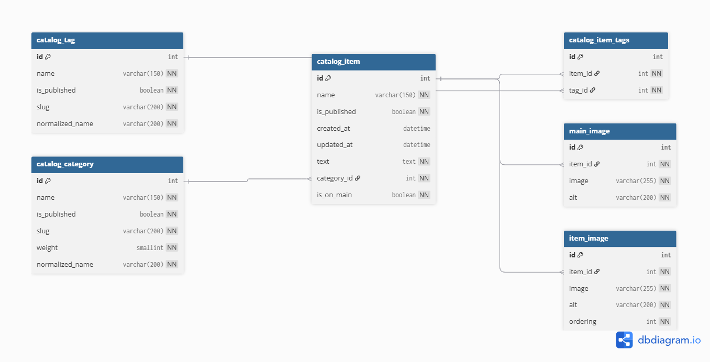

# Учебный проект «Lyceum»

[](https://gitlab.crja72.ru/django/2026/spring/course/students/379829-rizaeffk-course-1585/-/pipelines)

Это учебный проект для Специализации Яндекс Лицея «Веб-разработка на Django.

## CI/CD

В пайплайне настроены проверки:

- `flake8 --verbose` с плагинами:
  - `pep8-naming` (проверка имён по PEP8);
  - `flake8-import-order` (порядок импортов);
  - `flake8-quotes` (проверка кавычек).
- `black --check` (проверка форматирования без изменения файлов).

## Требования

- [Python](https://www.python.org/downloads/) (3.10-3.14)
- [Venv](https://pandac.in/blogs/venv-python/#:~:text=Install%20Python%203%20and%20venv,package%20you%20want%20to%20install.) (для создания виртуального окружения на Linux)
- [Git](https://git-scm.com/install/) (для клонирования репозитория)
- [gettext](https://mlocati.github.io/articles/gettext-iconv-windows.html) (для компиляции файлов локализации)

## Зависимости

Зависимости разделены по назначению:

- `requirements/prod.txt` — зависимости для запуска проекта;
- `requirements/test.txt` — зависимости для запуска тестов (включает `prod.txt`);
- `requirements/dev.txt` — зависимости для разработки (включает `test.txt`).

## Установка и запуск в dev-режиме (Linux/macOS)

1. Клонировать репозиторий:

   ```bash
   git clone https://gitlab.crja72.ru/django/2026/spring/course/students/379829-rizaeffk-course-1585
   cd 379829-rizaeffk-course-1585
   ```

2. Создать и активировать виртуальное окружение:

   ```bash
   python3 -m venv venv
   source venv/bin/activate
   ```

3. Установить dev зависимости:

   ```bash
   pip install -r requirements/dev.txt
   ```

4. Создание .env (проект содержит .env.example с дефолтными значениями переменных окружения, при необходимости отредактировать):

   ```bash
   cp .env.example lyceum/.env
   ```

5. Создайте db.sqlite3

   ```bash
   cp db.example.sqlite3 lyceum/db.sqlite3
   ```

6. Перейти в директорию проекта с `manage.py`:

   ```bash
   cd lyceum
   ```

7. Выполните миграцию:

   ```bash
   python3 manage.py migrate
   ```

8. Запустить сервер разработки:

   ```bash
   python3 manage.py runserver
   ```

9. (Опционально) Создайте суперпользователя для входа в админку:

   ```bash
   python3 manage.py createsuperuser
   ```

10. (Опционально) Скомпилируйте переводы интерфейса:

   ```bash
   django-admin compilemessages
   ```

## Установка и запуск в dev-режиме (Windows)

1. Клонировать репозиторий:

   ```powershell
   git clone https://gitlab.crja72.ru/django/2026/spring/course/students/379829-rizaeffk-course-1585
   cd 379829-rizaeffk-course-1585
   ```

2. Создать и активировать виртуальное окружение:

   ```powershell
   python -m venv venv
   .\venv\Scripts\Activate.ps1  
   ```

3. Установить dev зависимости:

   ```powershell
   pip install -r requirements/dev.txt
   ```

4. Создание .env (проект содержит .env.example с дефолтными значениями переменных окружения, при необходимости отредактировать):

   ```powershell
   copy .env.example lyceum\.env
   ```

5. Создайте db.sqlite3 (проект содержит db.example.sqlite3)

   ```powershell
   copy db.example.sqlite3 lyceum\db.sqlite3
   ```

6. Перейти в директорию проекта с `manage.py`:

   ```powershell
   cd lyceum
   ```

7. Выполните миграцию:

   ```powershell
   python manage.py migrate
   ```

8. Запустить сервер разработки:

   ```powershell
   python manage.py runserver
   ```

9. (Опционально) Создайте суперпользователя для входа в админку:

   ```powershell
   python manage.py createsuperuser
   ```

10. (Опционально) Скомпилируйте переводы интерфейса:

   ```powershell
   django-admin compilemessages
   ```

## После запуска

- Приложение доступно по адресу: <http://127.0.0.1:8000/>
- Админка доступна по адресу: <http://127.0.0.1:8000/admin> (если создан суперпользователь).
- Локализация поддерживает `ru` и `en`, переключатель языка находится в шапке сайта.

### Функционал пользователей

- Регистрация нового пользователя: `/auth/signup/`.
- Активация аккаунта после регистрации по ссылке из письма: `/auth/activate/<username>/` (срок действия ссылки — 12 часов).
- Вход через одно поле (логин или email): `/auth/login/`.
- Страница профиля: `/auth/profile/` (редактирование email, имени, даты рождения и аватара).
- Список активных пользователей: `/auth/users/`.
- Детальная страница пользователя: `/auth/users/<id>/`.

Дополнительно реализовано:

- Email-авторизация через отдельный backend `users.backends.UserAuthBackend`.
- Нормализация email в менеджере `UserManager`:
  - игнорируются `+tags` в локальной части;
  - домены `ya.ru` и `yandex.ru` приводятся к каноничному `yandex.ru`;
  - регистр игнорируется;
  - для `gmail.com` игнорируются точки в локальной части;
  - для `yandex.ru` точки в локальной части заменяются на `-`.
- Защита от перебора пароля:
  - количество неудачных попыток хранится в `Profile.attempts_count`;
  - при достижении лимита пользователь деактивируется;
  - отправляется письмо с ссылкой восстановления `/auth/reactivate/<username>/`;
  - ссылка восстановления действует 1 неделю.

## Переменные окружения (.env)

В проекте есть .env.example с комментариями. Основные переменные (пример):

```env
# Режим отладки: True для разработки, False для продакшена
DJANGO_DEBUG=True 

# Секретный ключ для криптографических подписей (в продакшене должен быть уникальным!)
DJANGO_SECRET_KEY=secret

# Список разрешенных хостов/доменов, через которые можно обращаться к приложению
DJANGO_ALLOWED_HOSTS="127.0.0.1,localhost"

# Включение middleware для реверса русского текста
DJANGO_ALLOW_REVERSE=False

# Активировать ли пользователя сразу после регистрации
DJANGO_DEFAULT_USER_IS_ACTIVE=True

# Максимум неудачных попыток входа до блокировки
DJANGO_MAX_AUTH_ATTEMPTS=3

# Адрес отправителя для служебных писем
DJANGO_MAIL=noreply@example.com
```

## Дополнительно

- Для запуска тестов перейдите в корневую директорию и установите также:

  ```bash
  pip install -r requirements/test.txt
  cd lyceum
  python manage.py test
  ```

- Для запуска в prod-режиме так же перейдите в корневую директорию:

  ```bash
  pip install -r requirements/prod.txt
  cd lyceum
  python manage.py runserver
  ```

## Админка

Для того чтобы зайти в админку нужно создать супер-пользователя:

   ```bash
   python3 manage.py createsuperuser
   ```

Админка будет доступна по адресу
<http://127.0.0.1:8000/admin>

## ER-диаграмма базы данных

В репозитории есть db.example.sqlite3. Это база для тестов, добавлена в репозиторий в учебных целях!

Ниже приведена ER-диаграмма, показывающая таблицы и связи в базе данных проекта.



- `catalog_category` — категории (1→N товаров);
- `catalog_item` — товары (имеют FK на категорию и M2M на теги);
- `catalog_tag` — теги (используются многократно для товаров);
- `main_image` — главная картинка товара (1→1 );
- `item_image` — галерея картинок (1 товар→N картинок);
- `feedback_feedback` — обращения пользователей (содержат тексти статус обработки);
- `feedback_feedbackpersondata` — данные отправителя (1→1 к обращению: имя и почта);
- `feedback_feedbackfile` — файлы, прикреплённые к обращению (1 обращение → N файлов);
- `feedback_statuslog` — история изменения статусов обращения (1 обращение → N записей лога).
- `auth_user` — пользователи системы (стандартная модель Django);
- `users_profile` — профиль пользователя (1→1 к пользователю, хранит доп. данные).

### Год в футере

- Без JavaScript показывается серверный год (через шаблон ``).
- С JavaScript год берётся из браузера пользователя только если расхождение с серверным временем не более 24 часов.
- Если расхождение больше 24 часов, показывается серверный год.
